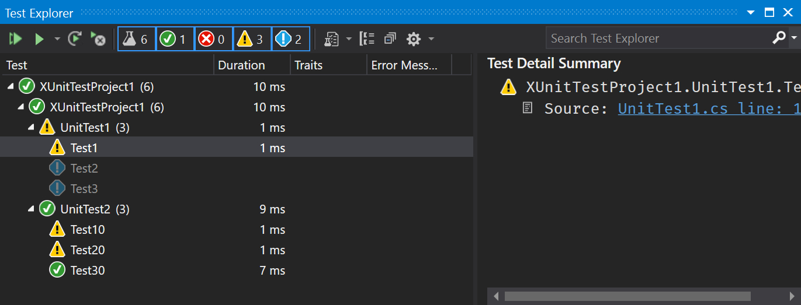
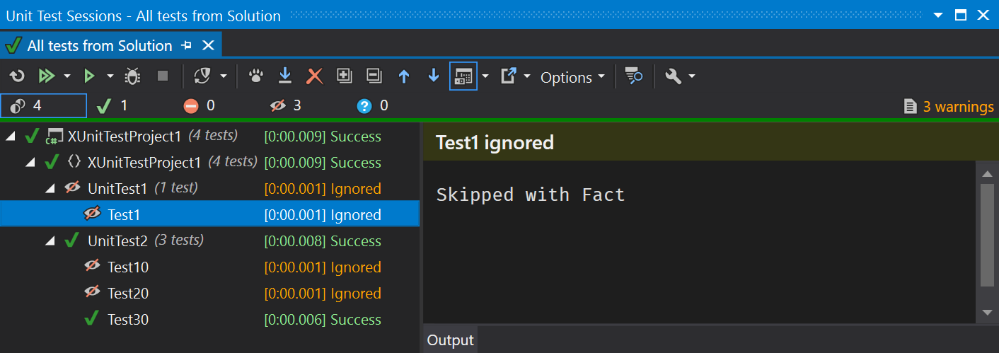
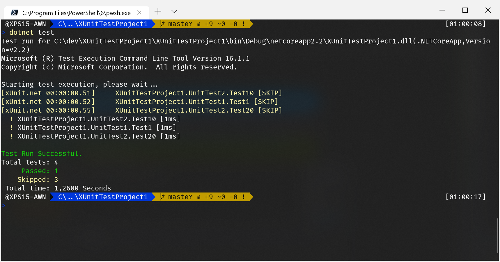
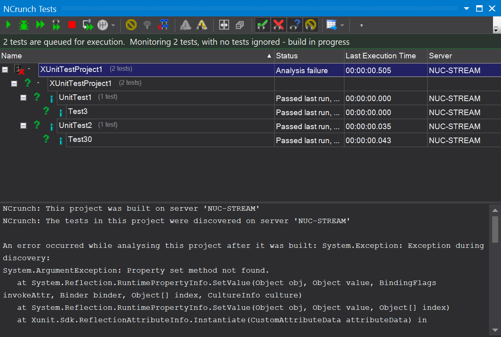

# Handling of Exceptions in xUnit Test Discovery

## TL;DR;

There is a possiblity that when xUnit is about to disover or run a test that there is a problem with that, like a thrown exception
because of something is going wrong. Then these and **other** Unit Tests are not run or complete swallowed. And ignoring Unit Tests
is not a good behavior of a test runner at all! 

## What happened
I discovered this while doing some analisys on some problem on a project where I'm not working daily on. So I opened the project,
run the test with NCrunch and then NCrunch shows me this Exception while running the tests.

```lang=csharp
An error occurred while analysing this project after it was built: System.Exception: Exception during discovery:
System.ArgumentException: Property set method not found.
   at System.Reflection.RuntimePropertyInfo.SetValue(Object obj, Object value, BindingFlags invokeAttr, Binder binder, Object[] index, CultureInfo culture)
   at System.Reflection.RuntimePropertyInfo.SetValue(Object obj, Object value, Object[] index)
   at Xunit.Sdk.ReflectionAttributeInfo.Instantiate(CustomAttributeData attributeData) in C:\Dev\xunit\xunit\src\xunit.execution\Sdk\Reflection\ReflectionAttributeInfo.cs:line 148
   at Xunit.Sdk.ReflectionMethodInfo.GetCustomAttributes(MethodInfo method, Type attributeType, AttributeUsageAttribute attributeUsage) in C:\Dev\xunit\xunit\src\xunit.execution\Sdk\Reflection\ReflectionMethodInfo.cs:line 100
   at Xunit.Sdk.ReflectionMethodInfo.GetCustomAttributes(String assemblyQualifiedAttributeTypeName) in C:\Dev\xunit\xunit\src\xunit.execution\Sdk\Reflection\ReflectionMethodInfo.cs:line 80
   at Xunit.Sdk.XunitTestFrameworkDiscoverer.FindTestsForMethod(ITestMethod testMethod, Boolean includeSourceInformation, IMessageBus messageBus, ITestFrameworkDiscoveryOptions discoveryOptions) in C:\Dev\xunit\xunit\src\xunit.execution\Sdk\Frameworks\XunitTestFrameworkDiscoverer.cs:line 84
   at Xunit.Sdk.XunitTestFrameworkDiscoverer.FindTestsForType(ITestClass testClass, Boolean includeSourceInformation, IMessageBus messageBus, ITestFrameworkDiscoveryOptions discoveryOptions) in C:\Dev\xunit\xunit\src\xunit.execution\Sdk\Frameworks\XunitTestFrameworkDiscoverer.cs:line 132
   at Xunit.Sdk.TestFrameworkDiscoverer.FindTestsForTypeAndWrapExceptions(ITestClass testClass, Boolean includeSourceInformation, IMessageBus messageBus, ITestFrameworkDiscoveryOptions discoveryOptions) in C:\Dev\xunit\xunit\src\xunit.execution\Sdk\Frameworks\TestFrameworkDiscoverer.cs:line 156
   at nCrunch.Module.XUnit2.Integration.XUnit2DiscoveryEnvironment.FindFrameworkTestsInAssembly(ReflectedAssembly assembly, FilePath assemblyFilePath, IList`1 referencedAssemblyFilePaths, ComponentUniqueName testComponentUniqueName, PlatformType platformType, DynamicProxy[] dynamicProxies)
   at nCrunch.TestExecution.TestFinder.<>c__DisplayClass2_2.<FindTestsForFrameworks>b__2()
   at nCrunch.Common.PerformanceTracking.PerfTracker.TrackActivity(String name, Action activity)
   at nCrunch.TestExecution.TestFinder.<>c__DisplayClass2_0.<FindTestsForFrameworks>b__0()
   at nCrunch.Common.PerformanceTracking.PerfTracker.TrackActivity(String name, Action activity)
   at nCrunch.TestExecution.TestFinder.FindTestsForFrameworks(ReflectedAssembly assembly, FilePath assemblyFilePath, IList`1 referencedAssemblyFilePaths, DescribedTestFrameworkDiscoverer[] describedDiscoverers, ComponentUniqueName testComponentUniqueName, PlatformType platformType, DynamicProxy[] dynamicProxies)
   at nCrunch.TestExecution.RemoteTaskRunner.AnalyseAssembly(DescribedTestFrameworkDiscoverer[] applicableFrameworks, ComponentUniqueName testComponentUniqueName, PerfTracker perfTracker)
```

This was weird, because our CI system and ReSharper never shown this, the builds and testruns, everything was green. So i assumed a Problem in NCrunch. After some hours i found out that this was not the case. The Problem was that dotnet test and resharper simply swallowed some test under special circumstances. I found the cause of the problem, found a simple repro, and did the test with all runners which a had direct access to. And every runner behaves not really as excepted. But `dotnet test` and ReSharper are the worst in my opionion because the tests completly disappeared.

The main problem was we had a getter only implementation of a derived `FactAttribute` which alone had no problem. Here is the simpliest implementatioin of that.
```
    public class SkipFactAttribute : FactAttribute
    {
        // Yes, this is a wrong implementation, but the compiler does not complain, so it seems
        // legit to override a getter/setter property with getter only.
        // The problem is not the wrong implementation, the problem is that exceptions in the xUnit test
        // discovery for whatever reason are not bubbled up, and in the worst case simple swallowed and 
        // the test does not run, but without any notice (each runner behaves a little bit different).

        public override string Skip => "Skipped";
    }
```
But if you set the Skip property, then the compiler is fine with that. But then the test and others tests disappeared or are not run (but not Skipped).

If you put the attribute `[SkipFact(Skip = "this one is where the problems starts")]` on a test method, **then THIS TEST METHOD AND ALL FOLLOWING TEST METHOD on that class will be not run, and unit test which are not running are a problem. because then they also does not report a possibly error in the code.** Ignoring the falsy test method is bad enough, but ignoring otherwise fine test methods is even worse.

What I think would be a good behavior, that when the Test Discovery failed, that a least the runner show me the exception on the Type of testing class, better it would also show also the test method where the problem occured.

But such a problem must never be slip through test runs, the error must bubble up. Yes, we made a mistake with implementing the
attribute not correctly, but other errors may also happend within the discovery and other phases before the test is run. So i think
this is more important than our mistake.

# Behavior of the different Unit Test Runners

Here are screenshots of the behavior of the different runners, for each runner there will be a open issue which is linked below.

## Visual Studio 2019 Pro 16.2



All Tests get discovered, but Test2 and Test3 are not run, without a given reason. But this is at least a information about something wrong. 

Bonus: Visual Studio does not display the Skip reason at all

## ReSharper 2019.2 with Visual Studio 2019 16.2



Test2 and Test3 are not discovered and not run, they disappeared silently.

## dotnet test sdk 2.2



Test2 and Test3 are not discovered and not run, they disappeared silently.

## NCrunch 3.30 with Visual Studio 2019 16.2



It shows the exception, it would be nice if NCrunch would name the Type which causes the problem. But this exception leads
to the finding of the problem, so in this scenario NCrunch behaves best.

But the running behavior is also not really deterministic, if test are discovered earlier they might be run again. Otherweise no test in the assembly at all are run.